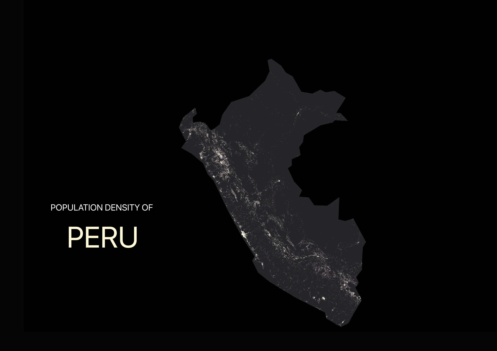
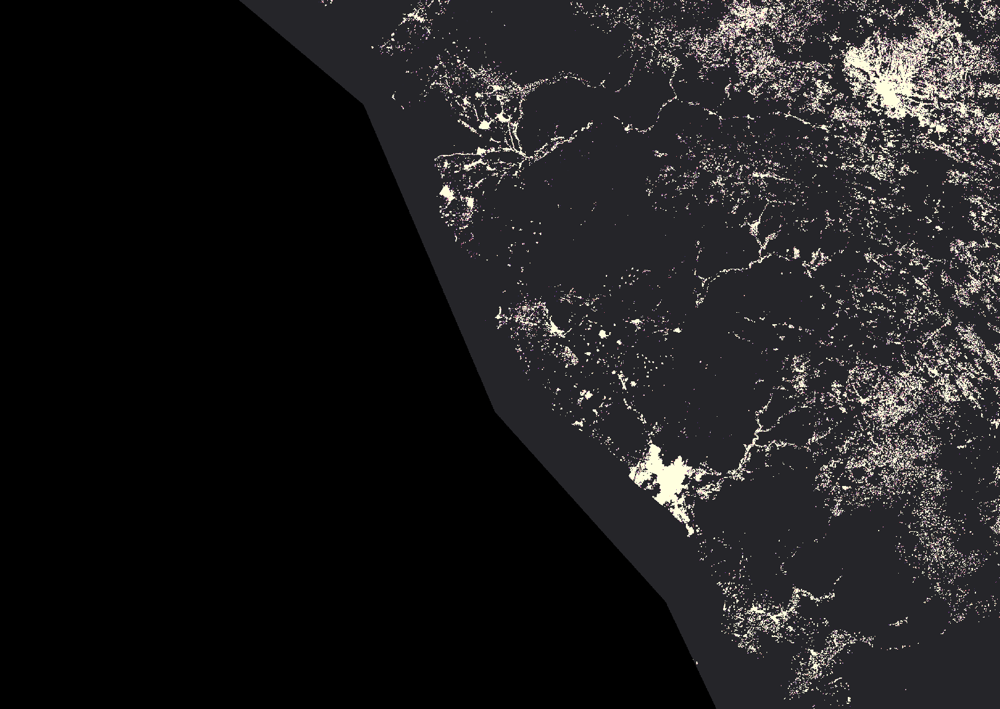

# Peru Population Density Map in QGIS

This project is a first attempt at creating population density maps of Peru in QGIS using `GHSL GHS-POP 2025` population data, inspired by Mashford Mahute’s population density mapping workflow.

The goal was not only to reproduce a similar visual style, but also to better understand how far the same workflow can translate across different countries. One of the main takeaways from this project is that it does not translate automatically. Egypt’s population distribution creates a very strong visual structure for this type of map, while Peru’s population pattern is much more dispersed across the coast, the Andes, and the interior, which makes the cartographic challenge quite different.

## Project goals

- Build Peru population density maps in QGIS using `GHSL GHS-POP 2025`
- Experiment with raster styling, layout composition, and dark-background cartography
- Learn a QGIS workflow involving `VRT` construction, clipping, `Singleband pseudocolor` symbology, and print layout design
- Test whether adding terrain structure could improve the final visual result

## Data sources

- **`GHSL GHS-POP 2025`**  
  Global Human Settlement Layer population raster used as the main population density data source.

- **`Natural Earth`**  
  Used for Peru national boundary extraction and masking.

- **`NASADEM` (attempted)**  
  I also experimented with terrain integration using `NASADEM` in order to add more relief and structure to the map, but did not complete that part in the final version because it became more technically involved than expected.

## Workflow

### 1. Download population data
Downloaded `GHSL GHS-POP 2025` tiles covering Peru.

### 2. Build a virtual raster
Merged the tiles into a single `VRT` in QGIS.

### 3. Clip to Peru boundary
Extracted Peru from `Natural Earth` country boundaries and used it to clip the raster with `peru_boundary`.

### 4. Style the raster
Styled the clipped raster in QGIS using:

- `Singleband pseudocolor`
- `Linear` interpolation
- dark-background map composition
- multiple rounds of color ramp and value range adjustment

### 5. Layout design
Created print layouts with:

- black background
- minimal white national outline
- a simple title treatment

### 6. Terrain experiment
I attempted to incorporate `NASADEM`-derived terrain to make the map feel less flat, but the integration process became more complicated than expected, so I stopped at a simpler first iteration rather than forcing a partial result into the final map.

## Main challenges

This project involved much more trial and error than I initially expected. Some of the main issues included:

- incomplete `GHSL` tile coverage at first
- rebuilding `VRT`s after adding missing raster tiles
- extracting a clean Peru boundary for clipping
- repeated adjustments to `Singleband pseudocolor` symbology and cumulative count cut settings
- trying to make the map feel less flat without overcomplicating the workflow
- realizing that Peru does not naturally produce the same kind of dramatic visual structure as Egypt under the same mapping logic

## Reflection

This project was a useful reminder that a strong map is not only about technical workflow. It also depends on the spatial structure of the place itself.

Egypt’s population density pattern creates an unusually dramatic visual logic for this kind of dark-background heat map. Peru is different. Its population is distributed more unevenly across coast, mountains, and interior regions, so the same workflow produces a different visual result and likely requires a different final rendering strategy.

I also suspect that the final image would benefit from an additional terrain or relief layer, but that part remains unfinished in this version.

## Close-up detail

A closer look at part of the map, highlighting the finer settlement texture and density patterns that become more visible at a more local scale.

## Close-up interpretation

This close-up likely captures the central coastal–Andean transition of Peru, most plausibly centered on the broader Lima-facing corridor rather than the country as a whole. At this scale, the map becomes much more legible as a spatial system: dense urban nodes, smaller settlement clusters, and connective settlement lines appear less like scattered points and more like a structured network. That interpretation is consistent with Peru’s broader geography, which is often understood through the contrast between the coast, the Andes, and the Amazon, and with the outsized demographic weight of Lima, whose metropolitan population exceeds 10 million and represents roughly 30 percent of the national population.  [oai_citation:0‡World Bank](https://documents1.worldbank.org/curated/en/099042523172028767/pdf/P17673801529a90dc0977e081f0d1df4f8d.pdf?utm_source=chatgpt.com)

From a geographic perspective, what stands out here is that population does not occupy space evenly. The visible pattern suggests concentration along corridors shaped by topography, accessibility, and long-standing settlement routes. In a country where coastal lowlands rise quickly into the Andes and where movement inland is strongly conditioned by relief, these kinds of clustered and corridor-like forms are not surprising.  [oai_citation:1‡World Bank](https://documents1.worldbank.org/curated/en/919181490109288624/pdf/Peru-SCD-final-3-16-17-03162017.pdf?utm_source=chatgpt.com)

From a demographic perspective, the image also highlights hierarchy. A few brighter nodes dominate, while surrounding areas are connected through finer-grained settlement belts and smaller urban fragments. At the national scale, these differences can get flattened into a single visual mass; at the local scale, they become much easier to read as distinct levels of density and connectivity. Peru’s broader urbanization pattern—large metropolitan concentration alongside regional and secondary urban centers—helps explain why this close-up is more revealing than the national view alone.  [oai_citation:2‡Gob.pe](https://www.gob.pe/en/institucion/inei/noticias/1092367-lima-supera-los-10-millones-400-mil-habitantes?utm_source=chatgpt.com)

From a planning and strategic perspective, this kind of detail is useful because it reveals where settlement appears concentrated, where it becomes fragmented, and where connectivity may depend on a limited number of spatial links. That has implications for infrastructure provision, service access, disaster response, and broader questions of territorial inequality and state reach. In Peru, where the Central Highway between Lima and Huancayo is only about 310 km yet plays a major connective role between coast and highlands, these corridor effects are especially meaningful.  [oai_citation:3‡World Bank](https://documents1.worldbank.org/curated/en/099220312062230940/pdf/P1771370dee2f508d085690f2197b9f346d.pdf?utm_source=chatgpt.com)

In that sense, this image is not just a zoomed-in version of the national map. It is a better view of how population, terrain, and connectivity interact at a scale where the internal logic of settlement becomes more visible.

## Files

- `new_peru.png` — national-scale version
- `peru_part1.png` — close-up detail view

## Notes

This repository focuses on documenting the workflow and outputs rather than packaging all raw raster data, since the source files are large. Raw population and DEM data should be downloaded directly from the original sources listed above.